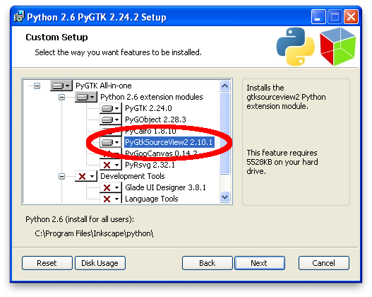
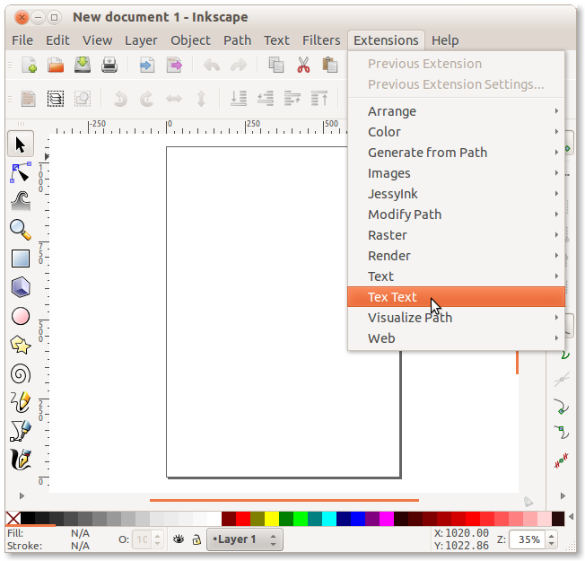
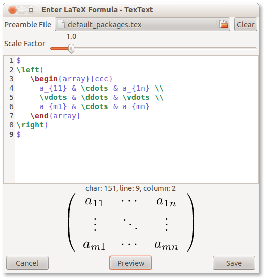

# Tex Text - A LaTeX extension for Inkscape

## Features
- Typesetting of beautiful equations using LaTeX which are placed as svg objects in your document.
- LaTeX equation objects can be re-edit later (in contrast to the built in LaTeX-tool).
- Free scaling and coloring of the objects possible.
- Usage of user defined preamble files (e.g. to include special packages etc.).

## Prerequisites

- A LaTeX distribution (e.g. TeX Live (Linux, Windows, MaxOS) or MiKTeX (Windows only)) has to be installed, especially `pdflatex` is needed.
- You need the 32bit version of Inkscape, of course.
- Depending on your operating system some extra software is required, see the specific instructions below.


## Installation for Linux [(or for Windows...)](#installation-for-windows).

### Tex Text Extension

To install *Tex Text*, simply run `python setup.py` in your terminal. All it does, is copying the necessary files to your Inkscape extension directory. If you don't trust this script, you'll have to copy all the files within the `extensions` directory to `~/.config/inkscape/extensions/`.

### Additional required software

- You'll need to install GtkSourceView (`python-gtksourceview2` on Ubuntu/Debian) to take advantage of all the GUI features of *Tex Text*. This package should install `python-gtk2` as well, but if your distribution works differently, make sure you install the Python Gtk+ bindings.

- Next, please install `pstoedit`.

- Finally, to enable the preview feature of *Tex Text*, you need to install `ImageMagick`.

*(The extension also needs Ghostscript, but this should already be included with your LaTeX distribution.)*

### Congratulations, you're done! [Show Usage...](#usage)


## Installation for Windows

### Tex Text Extension

The installation of *Tex Text for Inkscape* is straightforward: Simply use the installer `textext-0.5.2.exe` and follow the instructions (basically, click *Next*, *Install* and *Done*, since you usually won't even have to change the installation directory).


## Additional required software

### PyGTK

After that, download and install `pygtk-all-in-one-2.24.2.win32-py2.6.msi`. You find this file under [http://ftp.gnome.org/pub/GNOME/binaries/win32/pygtk/2.24/](http://ftp.gnome.org/pub/GNOME/binaries/win32/pygtk/2.24/). The installer will find the Python-Installation that comes embedded in Inkscape, because the *Tex Text*-Installer registered it with the Windows Registry for you.

{ width=75% }

On the second page, which lets you choose which parts to install, make sure you activate the item *PyGTKSourceView2 2.10.1* in order to enable the nicest GUI for *Tex Text*. You're not required to install it, but *Tex Text* won't look as nice as it could.

### Even more software that you might need to install

If you don't already have *Ghostscript*, *pstoedit* and *ImageMagick* installed on your machine, you'll have to install these as well.

- The installer for *pstoedit* is `pstoeditsetup-win32.exe` which  can be found under [https://sourceforge.net/projects/pstoedit/files/pstoedit/](https://sourceforge.net/projects/pstoedit/files/pstoedit/)
- To install *ImageMagick*, run `ImageMagick-6.8.8-7-Q16-x86-static.exe` which can be downloaded from [ftp://ftp.imagemagick.org/pub/ImageMagick/binaries/](ftp://ftp.imagemagick.org/pub/ImageMagick/binaries/) (more recent versions have not been tested yet)
- Depending on your machines architecture, install either the 32 or 64 bit version 9.10 or later of Ghostscript which can be downloaded from [https://ghostscript.com/download/gsdnld.html](https://ghostscript.com/download/gsdnld.html)

  32 bit                  |  64bit
------------------------- | ------------------------
`gs910w32.exe`            | `gs910w64.exe`


### Congratulations, you're done!

## Usage

The extension menu in Inkscape will now contain a new entry named *Tex Text*.

{ width=75% }

When you select it, a dialog will appear that lets you enter any LaTeX code you want (presumably your formula). It will highlight the syntax with colors, show you line numbers and more. Above the text field you can choose a scale factor between 0.1 and 10 in increments of 0.1. You can also choose a preamble file from your disk which shall be used for rendering your LaTeX code.

{ width=75% }

Basically, your LaTeX code will be inserted into this environment:

```
\documentclass[preview]{standalone}
***preamble file content***
\pagestyle{empty}
\begin{document}
***Your code***
\end{document}
```

This will be typeset and the result converted to SVG is inserted in your Inkscape document.

Your LaTeX code you and the accompanying settings (scale factor and optionally a preamble file) will be stored within the new SVG node in the document. This allows you to edit the LaTeX node later by selecting it and running the *Tex Text* extension (which will then show the dialog containing the saved values).

Any applied color or other styles will be kept when you update the LaTeX node using *Tex Text*.

There is a preview button as well, which shortens the feedback cycle from entry to result considerably, so use it! (It requires ImageMagick to be installed.)